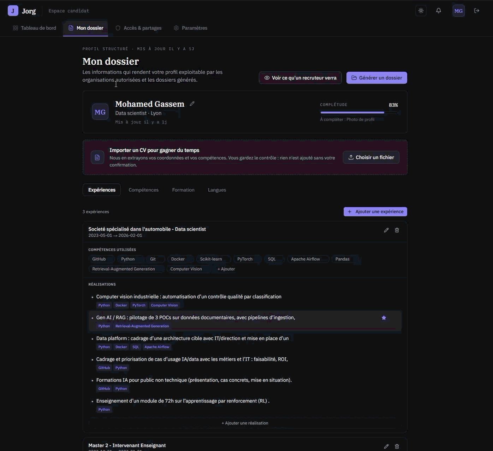
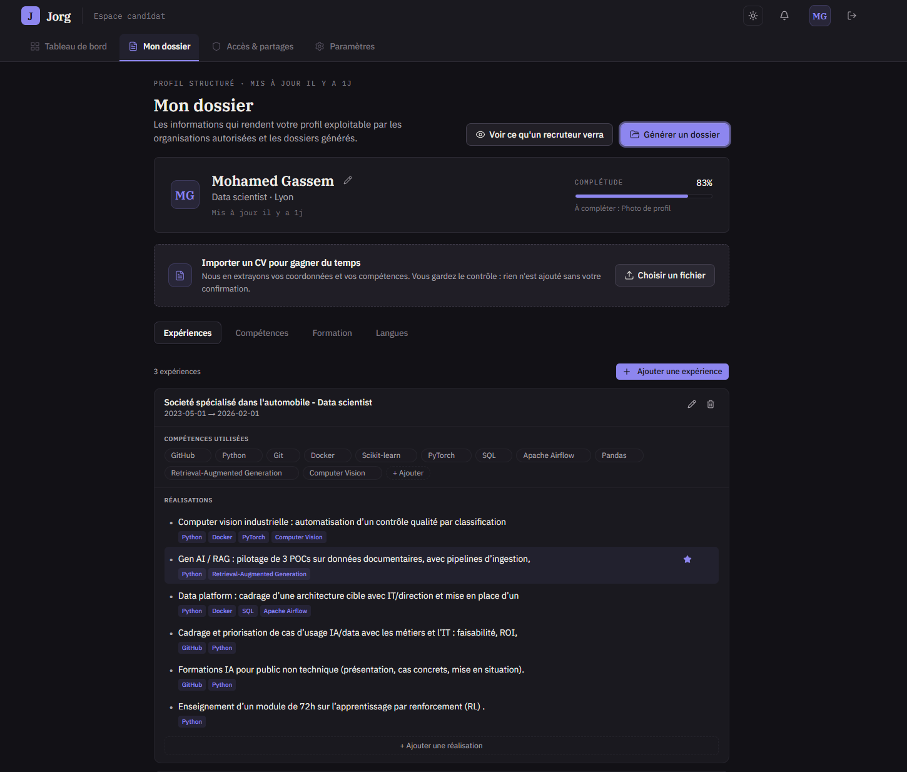
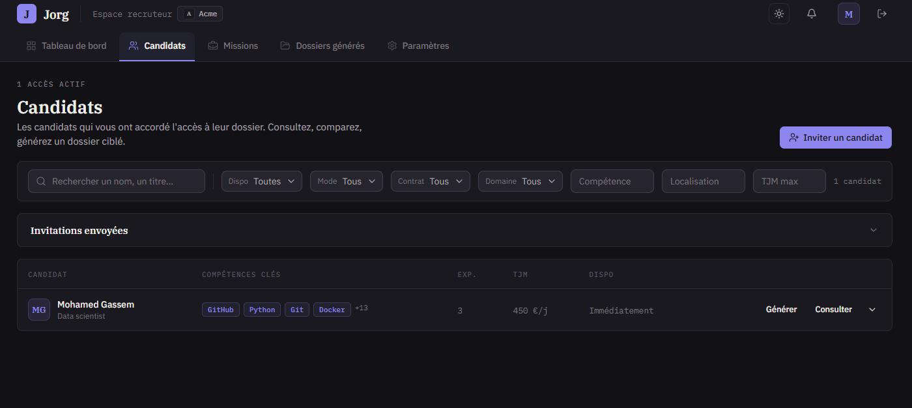

<div align="center">

# Jorg

**Candidates own their profile. Recruiters generate the documents.**

[](https://github.com/MohamedGassem/jorg/actions/workflows/backend-ci.yml)
[](https://github.com/MohamedGassem/jorg/actions/workflows/frontend-ci.yml)
[](LICENSE)


**[Try the live demo →](https://alpha-jorg.up.railway.app/)**

</div>

Recruiting firms keep asking candidates for "an updated CV", reformat it by hand
into their own template, and end up with stale copies of personal data scattered
across inboxes. Jorg replaces that flow: candidates maintain **one structured
profile** (experiences, skills, education, certifications, languages) and
recruiters generate **tailored Word/PDF documents** from their own templates,
always from up-to-date data, without ever receiving a CV file.

Candidates control their own data. They grant access per organisation and can
revoke it at any time.

<div align="center">
  
</div>

## How it works

1. A **recruiter** creates an organisation and uploads Word templates with `{{placeholder}}` variables.
2. The recruiter sends an **invitation** to a candidate by email.
3. The **candidate** accepts the invitation, granting the organisation access to their profile.
4. The recruiter generates a formatted document from any template + any candidate profile they have access to, and downloads it as `.docx` or `.pdf`.

## Screenshots

| Candidate profile                                          | Recruiter dashboard                                          |
| ---------------------------------------------------------- | ------------------------------------------------------------ |
|  |  |

## Stack

| Layer               | Tech                                                             |
| ------------------- | ---------------------------------------------------------------- |
| Backend             | Python 3.14, FastAPI, SQLAlchemy 2 (async), Alembic, Pydantic v2 |
| Frontend            | Next.js 16 (App Router), React 19, Tailwind CSS 4, Base UI       |
| Database            | PostgreSQL 18                                                    |
| Auth                | JWT (access + refresh tokens)                                    |
| Document generation | python-docx, optional LibreOffice for PDF                        |

## Prerequisites

- [Docker](https://docs.docker.com/get-docker/) (for the database)
- [uv](https://docs.astral.sh/uv/getting-started/installation/) (Python package manager)
- [Node.js](https://nodejs.org/) 20+

## Running locally

### 1. Clone and configure

```bash
git clone https://github.com/MohamedGassem/jorg.git
cd jorg
cp .env.example .env        # backend env — defaults work for local dev
```

### 2. Start the database

```bash
docker compose up -d
```

### 3. Backend

```bash
cd backend

# Install dependencies
uv sync

# Run migrations
uv run alembic upgrade head

# Start the API (http://localhost:8000)
uv run uvicorn main:app --reload
```

The interactive API docs are available at `http://localhost:8000/docs`.

#### Skill references (ESCO)

Skills are backed by the ESCO taxonomy. Two seeders are available (both idempotent):

```bash
# Small curated set (~50 skills) from data/esco_seed.csv — enough for tests/dev
uv run python scripts/seed_skill_references.py

# Full ESCO catalogue (~14k skills) from data/esco/skills_fr.csv
uv run python scripts/import_esco_full.py
# Smoke test a subset first if you like:
uv run python scripts/import_esco_full.py --limit 500
```

### 4. Frontend

```bash
cd frontend

# Install dependencies
npm install

# Start the dev server (http://localhost:3000)
npm run dev
```

Open `http://localhost:3000` in your browser.

## Project structure

```
jorg/
├── backend/
│   ├── api/routes/        # FastAPI routers (auth, candidates, recruiters, …)
│   ├── models/            # SQLAlchemy ORM models
│   ├── schemas/           # Pydantic request/response schemas
│   ├── services/          # Business logic
│   ├── alembic/           # Database migrations
│   └── tests/             # Unit and integration tests
└── frontend/
    ├── app/
    │   ├── (candidate)/   # Candidate-facing pages
    │   └── (recruiter)/   # Recruiter-facing pages
    ├── components/        # Shared UI components
    ├── lib/               # API client, auth helpers
    └── types/             # TypeScript API types
```

## Running tests

```bash
cd backend
uv run pytest
```

Integration tests spin up a temporary PostgreSQL container via Testcontainers — Docker must be running.

## Pre-commit hooks

Install [pre-commit](https://pre-commit.com/) then run:

```bash
pre-commit install
```

Hooks run automatically on `git commit`. To run manually on all files:

```bash
pre-commit run --all-files
```

TypeScript typecheck (slow) runs only manually:

```bash
pre-commit run tsc --hook-stage manual
```

## Environment variables

Copy `.env.example` to `.env` in the project root. The defaults are configured for local development and require no changes to get started.

| Variable                      | Description                            |
| ----------------------------- | -------------------------------------- |
| `DATABASE_URL`                | PostgreSQL connection string           |
| `SECRET_KEY`                  | JWT signing key — change in production |
| `ACCESS_TOKEN_EXPIRE_MINUTES` | Access token lifetime (default: 15)    |
| `REFRESH_TOKEN_EXPIRE_DAYS`   | Refresh token lifetime (default: 30)   |
| `EMAIL_BACKEND`               | `console` (prints to stdout) or `smtp` |
| `FRONTEND_URL`                | Used in invitation email links         |

## Contributing

Contributions are welcome, see [CONTRIBUTING.md](CONTRIBUTING.md). By
submitting a contribution you accept the contributor license terms described
there (the project is dual-licensed, see below).

## Licensing

This project is dual-licensed:

- **Open Source**: GNU Affero General Public License v3.0 (AGPL-3.0) — see [LICENSE](LICENSE)
- **Commercial License**: required for proprietary use — see [COMMERCIAL_LICENSE.md](COMMERCIAL_LICENSE.md)

### Which license applies to you?

**If you comply with AGPL-3.0**, you may use this software for free. The AGPL-3.0
requires that if you distribute the software or run it as a network service, you
must make the complete source code of your application available to users under
the same license. If that is acceptable for your use case, no purchase is needed.

**If you want to keep your code closed**, use the software in a SaaS product
without releasing your source code, or integrate it into internal business tools
without AGPL compliance, you must obtain a commercial license.

To purchase a commercial license or ask about your specific use case, contact:

**Mohamed Gassem**
mohamed.gassem@gmail.com
